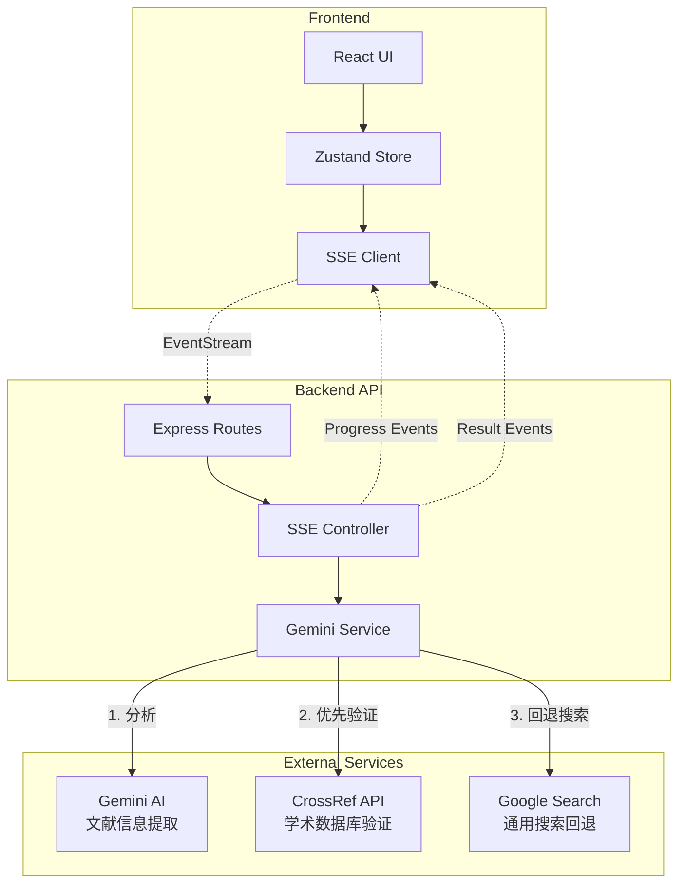

# Reference Verifier Architecture

## System Overview
参考文献验证系统采用前后端分离架构，通过**三阶段智能验证流程**（AI分析 → CrossRef学术验证 → Google搜索回退）验证学术参考文献的真实性和准确性。

## Technology Stack

### Frontend
- **Framework**: React 18
- **State Management**: Zustand
- **UI Library**: Tailwind CSS
- **HTTP Client**: Axios (支持SSE流式响应)
- **Build Tool**: Vite

### Backend
- **Runtime**: Node.js
- **Framework**: Express.js
- **AI Integration**: Google Gemini 2.0 Flash API
- **Academic Validation**: CrossRef API
- **Search Integration**: Google Custom Search API
- **Streaming**: Server-Sent Events (SSE)
- **HTTP Client**: Axios with HTTPS Agent (代理支持)

## System Architecture



## Three-Stage Verification Flow

### Stage 1: AI Analysis (Gemini)
- **目的**: 智能解析参考文献，提取结构化信息
- **输入**: 原始参考文献文本
- **输出**: 
  ```json
  {
    "type": "journal/book/conference/website",
    "authors": ["author1", "author2"],
    "title": "Article Title",
    "journal": "Journal Name",
    "year": 2024,
    "doi": "10.1234/example"
  }
  ```

### Stage 2: Academic Verification (CrossRef)
- **目的**: 通过学术数据库验证文献真实性
- **策略**: 
  - 期刊文章 → CrossRef DOI/标题搜索
  - 会议论文 → CrossRef会议记录搜索
  - 书籍/网站 → 跳过，直接进入Stage 3
- **优势**: 高准确率、权威性强、包含元数据

### Stage 3: Search Engine Fallback (Google)
- **目的**: 作为补充验证手段
- **触发条件**:
  - CrossRef无结果或匹配度低
  - 非学术类参考文献（网站、报告等）
- **验证方式**: 组合关键词搜索，分析搜索结果相关性

## API Design

### POST /api/verify-references-stream (主要接口)
- **类型**: Server-Sent Events (SSE)
- **特点**: 实时进度反馈、流式结果传输
- **事件类型**:
  ```
  event: progress
  data: {"current": 1, "total": 5, "percentage": 20}
  
  event: result
  data: {
    "reference": "原始文献",
    "status": "verified/not_found/mismatch/ambiguous/error",
    "confidence": 0.95,
    "source": "crossref/google",
    "url": "https://doi.org/...",
    "message": "验证详情"
  }
  
  event: complete
  data: {"message": "Verification completed"}
  ```

### POST /api/verify-references (备用接口)
- **类型**: 传统RESTful API
- **用途**: 小批量验证、不支持SSE的客户端

## Verification Status Types

- **verified** ✅: 文献已确认存在且信息匹配
- **not_found** ❌: 在所有来源中均未找到
- **mismatch** ⚠️: 找到相似文献但关键信息不匹配
- **ambiguous** 🔍: 存在多个可能匹配，无法确定
- **error** ❗: 验证过程中出现技术错误

## Performance Optimizations

1. **批量处理**: Gemini批量分析多个参考文献
2. **并发验证**: CrossRef和Google请求并行处理
3. **流式响应**: SSE实时推送结果，改善用户体验
4. **智能缓存**: 相同文献验证结果短期缓存

## Security & Reliability

1. **API密钥管理**: 环境变量存储，永不暴露前端
2. **代理支持**: 统一HTTPS Agent配置处理网络限制
3. **错误处理**: 三层错误捕获（服务→控制器→路由）
4. **速率限制**: 防止API配额耗尽
5. **输入验证**: 防止恶意输入和注入攻击

## Configuration

### Environment Variables (.env)
```bash
# AI Service
GEMINI_API_KEY=your_api_key

# Search Services  
GOOGLE_API_KEY=your_api_key
GOOGLE_CX=your_search_engine_id

# Network
PROXY_URL=http://proxy.example.com:8080  # Optional

# Server
PORT=3000
```

## Future Enhancements

1. **扩展数据源**: 集成PubMed、arXiv等专业数据库
2. **结果缓存**: Redis缓存层提升重复查询性能  
3. **批量导出**: 支持验证报告PDF/Excel导出
4. **用户系统**: 历史记录、配额管理
5. **API限流**: 更精细的用户级别限流策略